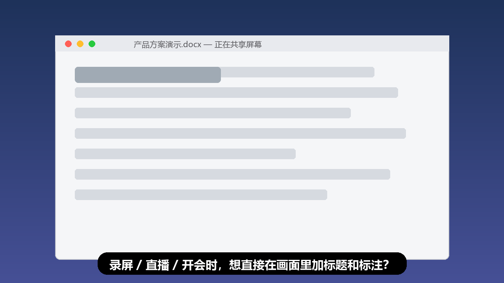

# TitleIt — 把任何图片、GIF、视频"贴"在屏幕上

**TitleIt 是一款 Windows 桌面贴图工具**：把标题、Logo、参考图、操作演示动图变成**无边框、透明背景、永远置顶**的屏幕贴图——不用后期合成，录屏、直播、演示时直接出现在画面里。

下载只有一个 `TitleIt.exe`，**双击即用**：无需安装、无需管理员权限、无需装 PowerShell 或 FFmpeg（全部内置）。

---

## 它能做什么？

- 📌 **图片置顶贴图**：PNG / JPG / GIF / WebP / PSD / HEIC 等 20+ 格式，直接拖上屏幕，无边框透明显示
- 🎬 **视频/GIF 也能贴**：MP4 / MOV / MKV 等视频原地循环播放，带进度条、逐帧、变速，甚至内置**简单剪辑**
- ✂️ **框选截图 → 原位置顶**：`Ctrl+1` 圈一块屏幕，截图直接钉在原处，同时进剪贴板
- ⏺️ **框选录制动图**：`Ctrl+2` 圈一块区域按空格，录成循环 MP4/GIF 并原位置顶，30/60 FPS 可选
- 🖊️ **桌面画笔**：`Ctrl+4` 直接在屏幕上画箭头、方框、马赛克、文字批注
- 🗂️ **资产收纳库**：Eagle 风格的素材库，常用图片/视频分类存页签，随取随用，支持剪贴板互导
- 📝 **文本便签**：`Ctrl+5` 随手贴一张文字便签
- 🙈 **不被录屏捕获**：单张贴图可勾选排除截图/录屏——提词、参考图只给自己看，观众看不到

## 谁需要它？

| 人群 | 用法 |
| --- | --- |
| **录课 / 做教程的人** | 屏幕角落贴标题、步骤提示、Logo；画笔现场圈重点 |
| **主播 / Up 主** | 贴 Logo、表情包、关注引导图，免 OBS 图层配置 |
| **设计师 / 画师** | 参考图半透明置顶浮在画图软件上，滚轮调透明度描图 |
| **远程会议演示者** | 便签贴在共享屏幕边缘当提词器，勾选"不被捕获"后对方看不到 |
| **任何需要对照两个窗口内容的人** | 把资料截图钉在旁边，不用来回切窗口 |

## 为什么好用？

- **单文件绿色版**：整个程序就是一个 exe，拷到 U 盘走到哪用到哪，设置自动保存
- **格式通吃**：系统打不开的格式（HEIC、PSD、EXR、ProRes 视频…）内置 FFmpeg 自动转码，原文件不动
- **记住一切**：每张图的位置、大小、透明度、锁定状态都会记住，重启后原样恢复
- **为录屏而生**：贴图无边框无标题栏，控制条移开鼠标自动隐藏，画面干净
- **批量操作**：选中一堆图片拖到 exe 上，一次性全部贴出来

## 快速上手

1. 下载本仓库的 [`TitleIt.exe`](./TitleIt.exe)（或 [Releases](../../releases) 页面）
2. 放到任意文件夹，双击运行（首次启动会释放内置运行时，等几秒；之后秒开）
3. 系统如弹安全提示，选择"仍要运行"（个人开发者软件未购买签名证书，属正常现象）
4. 程序驻留系统托盘 → 右键托盘图标 → **添加图片或动图**，或直接把图片/视频拖给它

### 最常用的几个快捷键

| 快捷键 | 作用 |
| --- | --- |
| `Ctrl+1` | 框选截图并原位置顶 |
| `Ctrl+2` | 框选录制循环动图 |
| `Ctrl+3` | 框选截图只进剪贴板 |
| `Ctrl+4` | 桌面画笔 |
| `Ctrl+5` | 新建文本便签 |
| `Ctrl + 反引号` | 打开资产收纳库 |
| `Ctrl+Alt+H` | 一键隐藏/显示全部贴图 |
| 悬停滚轮 / `Shift`+滚轮 | 缩放 / 调透明度 |
| 双击贴图 | 收起成小方块，再双击恢复 |

全部快捷键都可以在「设置 → 快捷键设置」里自定义或禁用。

## 录屏/OBS 提示

- OBS 请使用**显示器采集**（窗口采集不会包含置顶贴图）
- 独占全屏游戏可能盖住贴图，用无边框窗口化最可靠
- 不想让某张贴图进录屏？右键勾选**"不被截图/录屏捕获"**

## 许可

本软件为免费软件（Freeware），可自由使用；版权所有，不提供源代码，不得反向工程或再分发。

---

💡 觉得好用可以 Star 本仓库，或把它分享给需要的人。
